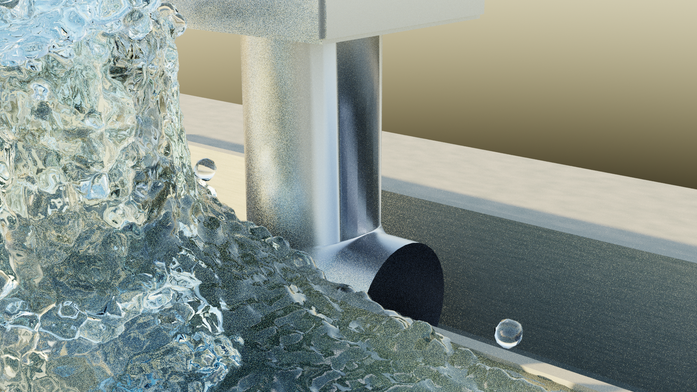

# Escorrimento — simulador da captação de água por uma locomotiva

Este programa simula, com física de verdade, um truque usado pelas
ferrovias a vapor: a locomotiva passa em alta velocidade sobre um canal
raso de água entre os trilhos, mergulha um tubo em forma de L, e a própria
velocidade do trem empurra a água tubo acima até um reservatório — sem
nenhuma bomba.

O simulador resolve as equações do movimento dos fluidos (Navier–Stokes)
num corte do canal, mostra a água em tempo real e **compara ao vivo o que
a simulação mede com o que a teoria prevê**.

## Como abrir (sem saber programar)

1. Instale o **Node.js** (versão 18 ou mais nova) uma única vez:
   baixe em <https://nodejs.org> (botão verde "LTS") e instale como
   qualquer programa.
2. Dê **duplo clique** no arquivo certo para o seu computador:
   - Windows: `iniciar.bat`
   - macOS: `iniciar.command` (na primeira vez: clique com o botão
     direito → Abrir)
   - Linux: `iniciar.sh` (ou rode `./iniciar.sh` num terminal)

O script instala o que falta, compila e abre o navegador sozinho. Se o
Node.js não estiver instalado, ele avisa em português o que baixar.

Requisito: um navegador atual (Chrome, Edge ou Firefox recentes).

## Abrir no celular

O simulador funciona no celular (Android e iPhone) — a simulação roda
dentro do próprio aparelho, no navegador. Não existe site na internet: quem
serve a página é o seu computador, pela rede Wi-Fi de casa.

1. Deixe o **computador e o celular na mesma rede Wi-Fi**.
2. No computador, dê duplo clique em:
   - Windows: `iniciar-celular.bat` (se o Windows perguntar, **permita** o
     acesso do Node.js à rede privada)
   - macOS: `iniciar-celular.command`
   - Linux: `iniciar-celular.sh`
3. Vai aparecer um **QR Code** na janela preta. Abra a câmera do celular,
   aponte para ele e toque no aviso que surge na tela.
   (Se preferir, digite no navegador do celular o endereço que aparece
   logo abaixo do QR Code, algo como `http://192.168.0.10:5173/`.)

No celular a tela vira uma coluna: a simulação em cima e, embaixo, as abas
**Controles** e **Medições**. **Um dedo arrasta** a cena, **dois dedos dão
zoom** e **dois toques rápidos** voltam ao enquadramento inicial.

Uma observação honesta: o cálculo é feito pelo processador do telefone, que
é bem mais modesto que o de um computador. Por isso a simulação começa numa
grade menor (128 células em vez de 192) — com menos células ao longo do
duto, a perda de carga numérica aumenta e a velocidade medida fica ainda
mais abaixo da teórica. Esse desvio não é escondido: ele aparece na aba
**Medições**, junto com o coeficiente de perda K medido. Aumentando
*Resolução* no painel a física melhora e o aparelho fica mais lento.

Se o celular não abrir a página, quase sempre é uma destas causas: os dois
aparelhos estão em redes diferentes (por exemplo, o celular no 4G), o
firewall do computador bloqueou o Node.js, ou a rede é de um local público
que isola os dispositivos entre si.

## O que você vai ver

- **A cena**: a água chega pela direita (é o mundo passando, visto do
  trem), bate na boca do tubo (ponto C), sobe pelo cano, sai no bocal (A)
  e cai no reservatório.
- **Painel esquerdo**: controles. Passe o mouse sobre qualquer controle
  para ver a explicação. Os principais:
  - **Velocidade do trem V** — abaixo de ~4.4 m/s (para H = 1 m) a água
    não sobe: é a velocidade mínima √(2gH) prevista pela teoria. Aumente
    V e veja a vazão crescer.
  - **Altura do bocal H** — quanto mais alto, mais energia é preciso.
  - **Câmera lenta** — 0.25×, 0.1×, 0.02× para ver gotas e ondas.
- **Painel direito ("Medição × Teoria")**: cada linha compara o valor
  MEDIDO na simulação com a fórmula teórica e mostra o erro. Verde = bate
  bem; vermelho = desvia (e o painel explica por quê).
- **Tecla M**: alterna entre o visual realista e o **modo científico**
  (campos de velocidade/pressão coloridos, setas, e as linhas douradas que
  mostram exatamente QUAL água acaba capturada pelo tubo).
- **Varredura**: o botão "📈 Varredura de V" roda vários valores de V
  sozinho e desenha os gráficos medidos por cima das curvas teóricas —
  incluindo o teste mais bonito: a pressão na boca C **não depende de V**.

## O que observar (física em ação)

1. A água **desacelera antes de entrar** no tubo — as linhas douradas do
   modo científico "engordam" ao se aproximar da boca.
2. Dentro do tubo a velocidade é constante; **o que muda com a altura é a
   pressão** (gráfico no canto, com a reta teórica por cima).
3. A sobrepressão na boca C vale ρgH **qualquer que seja V**.
4. O jato sobe acima do bocal até v²/2g — em V alto ele estoura o teto da
   tela (o aviso conta quanta água se perdeu; use o preset "domínio alto").

## Honestidade científica — leia isto

Este simulador **não maquia resultados**. Onde a simulação diverge da
teoria, o painel mostra o desvio e explica. Limitações declaradas:

1. **É LES, não DNS**: o escoamento real tem Re ≈ 2×10⁶; a turbulência
   menor que a grade é modelada (Smagorinsky), não resolvida.
2. **O modo 2D distorce o problema**: no corte 2D a água não pode
   contornar o tubo pelos lados — com os valores padrão o tubo bloqueia
   83% da profundidade do canal, forma onda de proa e o escoamento pulsa.
   A comparação quantitativa fiel é feita **em 3D** (headless): rode
   `npm run validate` e veja `docs/VALIDACAO.md`.
3. **Não há ar** na simulação (a fase gasosa é vazio a pressão constante);
   a espuma real é subestimada.
4. Com **paredes no-slip** a velocidade medida fica ABAIXO de √(V²−2gH) —
   isso é correto e esperado: a fórmula é o limite sem atrito.
5. **Cavitação não é modelada** — se a pressão calculada cair abaixo da
   pressão de vapor (~2.3 kPa), aparece um aviso.
6. Com a geometria padrão da especificação (D = 0.25 m num canal de
   0.30 m), a submersão de 0.10 m deixaria o lábio da boca fora d'água; o
   padrão adotado é 0.15 m (boca inteira submersa) — ajustável no painel.

## Limitações e decisões de engenharia (para quem é técnico)

- **Solver na CPU (Web Worker), render em WebGL2.** A especificação de
  origem pedia compute em WebGPU com 60 fps; um MGPCG+FLIP completo em
  WGSL não coube no escopo com a qualidade de validação exigida. A escolha
  foi: um único solver correto, determinístico e testado (7 testes
  canônicos passando — hidrostático exato, divergência ~10⁻⁷, Poiseuille,
  Taylor–Green, dam break vs Martin & Moyce 1952, conservação de massa,
  determinismo bit a bit) rodando na CPU, com a UI desacoplada num worker
  (nunca congela). Na prática a cena 2D roda a ~0.05–0.1× o tempo real —
  uma "câmera lenta natural". A portagem dos kernels para WebGPU é o
  próximo passo natural do projeto.
- **Modo 3D**: implementado e usado pela validação quantitativa headless
  (`npm run validate`); não é interativo no navegador (CPU não alcança).
- O modo cinematográfico é o pipeline de fluido em espaço de tela adaptado
  ao corte 2D (blur bilateral, refração, Beer–Lambert, Fresnel, GGX,
  espuma física por variância de velocidade, cáusticas, bloom, ACES) — os
  passes que exigem cena 3D (sombras em cascata, HDRI real, profundidade
  de campo) não estão nesta versão.
- Sem bibliotecas de física: todo o solver está em `src/solver/`, escrito
  do zero, comentado em português com as equações discretizadas.

## Renderização fotorrealista (Blender)

Para água indistinguível da real, o projeto exporta a simulação 3D e
renderiza no Blender/Cycles (gratuito) — **a física é 100% deste solver;
o Blender entra só como renderizador**. Pipeline testado de ponta a ponta:

```bash
# 1) roda a simulação 3D e exporta as partículas (PLY por quadro):
npm run export:blender          # padrões: V=8, 4 s, 24 fps → exports/

# 2) renderiza (Blender 3.6+ instalado; o script acha o executável sozinho):
npm run render:blender -- exports 1 96 --samples=256
# → exports/render/quadro_####.png (junte em vídeo com ffmpeg)
```

O passo 2 procura o Blender nos lugares habituais (PATH, *Program Files*,
Steam, `/Applications`, snap/flatpak). Se ele estiver instalado num lugar
incomum, informe o caminho:

```powershell
$env:BLENDER = "D:\Blender\blender.exe"   # PowerShell
npm run render:blender -- exports 1 96
```

Exemplo real produzido por esse pipeline (48 amostras, sem denoise):



## Para desenvolvedores

```bash
npm install         # dependências
npm run dev         # servidor de desenvolvimento (http://localhost:5173)
npm test            # testes canônicos do solver (§7.1) — ~4 min
npm run validate    # validação completa + relatório docs/VALIDACAO.md
                    # (inclui os pontos 3D; use --skip3d para pular)
npm run export:blender  # exporta partículas 3D para o Blender
npm run build       # build de produção em dist/
```

Documentação: `docs/FISICA.md` (derivação completa das fórmulas),
`docs/NUMERICA.md` (método numérico e decisões, incluindo os modos de
falha encontrados no desenvolvimento), `docs/VALIDACAO.md` (números
medidos × teoria, gerado por `npm run validate`).

Estrutura: `src/solver` (grade MAC, APIC, projeção, SDF, cenas),
`src/physics` (fórmulas analíticas, sondas, varredura, CSV), `src/render`
(pipeline de água WebGL2, cenário), `src/ui` (painel, HUD, gráficos),
`src/app` (worker + protocolo), `src/tests` (testes canônicos e validação).

Sem assets externos: céu, brita, aço, espuma e cáusticas são procedurais
(nenhum arquivo de textura/HDRI para licenciar).
